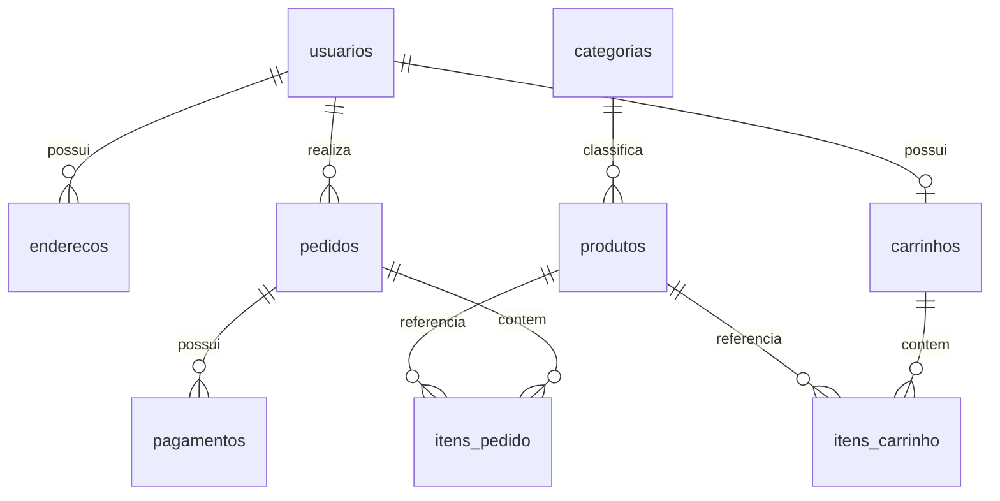

# Modelagem do KitGift

DER lógico atualizado para os nomes implementados no script SQL. As nove entidades derivam do diagrama fornecido pela equipe.

As chaves e campos completos estão em [script.sql](../bd/script.sql). Um carrinho pode estar vazio; um pedido pode ser criado antes de receber itens, dentro de uma transação. A futura finalização de compra deverá exigir pelo menos um item, validar estoque e calcular os totais. Não foram implementadas regras de checkout ou integrações financeiras nesta etapa.
